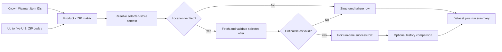

> **Live API:** [Run Walmart Multi-Zip Monitor on Apify](https://apify.com/kamerozkan/walmart-multi-zip-monitor)

# Walmart Product Scraper - Price & Stock by ZIP: Samples

Walmart product scraper and price tracker for known product IDs across US ZIP codes. Compare local prices, digital stock, sellers and fulfillment options. Monitor price drops and restocks across repeat runs. Store context is verified; unavailable source fields stay explicit.

[Run Walmart Product Scraper - Price & Stock by ZIP on Apify](https://apify.com/kamerozkan/walmart-multi-zip-monitor)

[](https://apify.com/kamerozkan/walmart-multi-zip-monitor)


Check known Walmart.com product IDs across a bounded set of U.S. ZIP codes. Each row reports a point-in-time selected-store context, price, digital availability, seller, fulfillment signals, history fields, or an explicit failure.

This repository contains three runnable inputs, three privacy-minimized live output samples, and the complete row contract in [`dataset_record.schema.json`](dataset_record.schema.json).

## Start here

1. Open the [Actor on Apify](https://apify.com/kamerozkan/walmart-multi-zip-monitor).
2. Copy an input sample below.
3. Start with a small product and ZIP matrix.
4. For change detection, keep the same task and stable `monitorName` across scheduled runs.

At the 2026-07-28 audit, the Store exposed **two public Example Tasks**. Inputs 01 and 02 are exact copies of those public examples. Input 03 mirrors an existing private task configuration whose task run count was zero. It is a runnable configuration, not evidence of results.

## Input examples

<details>
<summary><strong>01. Compare two products across five ZIP codes</strong> - public Store Example Task</summary>

[`01_compare_five_zip_codes.json`](01_compare_five_zip_codes.json)

```json
{
  "failOnCriticalHealth": true,
  "includeUnchanged": true,
  "products": [
    {
      "itemId": "10450114",
      "reference": "whole-milk-gallon"
    },
    {
      "itemId": "10534289",
      "reference": "hash-brown-patties"
    }
  ],
  "zipCodes": [
    "10001",
    "90210",
    "60601",
    "33101",
    "75201"
  ]
}
```

</details>

<details>
<summary><strong>02. Price and restock watch</strong> - public Store Example Task</summary>

[`02_price_restock_watch.json`](02_price_restock_watch.json)

```json
{
  "products": [
    {
      "itemId": "10315355",
      "reference": "white-bread"
    },
    {
      "itemId": "10450114",
      "reference": "whole-milk-gallon"
    },
    {
      "itemId": "10534289",
      "reference": "hash-brown-patties"
    }
  ],
  "zipCodes": [
    "10001",
    "60601",
    "90210"
  ],
  "monitorKey": "public-price-restock-watch",
  "includeUnchanged": true
}
```

`monitorKey` is retained because this file reproduces the exact public Store example. It is a deprecated compatibility field, not an API credential. New configurations should use `monitorName`.

</details>

<details>
<summary><strong>03. Grocery change-only watch</strong> - existing private task configuration</summary>

[`03_grocery_change_only_watch.json`](03_grocery_change_only_watch.json)

```json
{
  "products": [
    {
      "itemId": "10450118",
      "reference": "stable-milk-canary"
    }
  ],
  "zipCodes": [
    "10001",
    "60601",
    "75201"
  ],
  "includeUnchanged": false,
  "maxConcurrency": 1,
  "proxyMode": "RESIDENTIAL",
  "failOnCriticalHealth": true,
  "monitorName": "walmart-grocery-price-tracker"
}
```

</details>

## Output examples

All three files below were observed in successful Actor runs and then redacted. No replay output is included. Output 01 and output 03 came from the latest successful run available during the audit. Output 02 came from the latest successful public price-and-restock Example Task run. See [`DATA_NOTICE.md`](DATA_NOTICE.md) for exact provenance.

<details>
<summary><strong>01. Validated IN_STOCK digital signal</strong> - live run</summary>

[`01_live_validated_in_stock.json`](01_live_validated_in_stock.json)

```json
{
  "combinationId": "redacted-combination-live-01",
  "inputRef": "whole-milk-gallon",
  "itemId": "10450114",
  "zipCodeRequested": "72712",
  "zipCodeResolved": "72712",
  "locationApplied": true,
  "storeId": "4376",
  "storeDistanceMiles": 0.51,
  "status": "success",
  "reasonCode": null,
  "reasonCodes": [],
  "failureStage": null,
  "message": null,
  "title": "Great Value Whole Vitamin D Milk, Gallon",
  "price": 3.14,
  "currency": "USD",
  "availability": "IN_STOCK",
  "sellerName": "Walmart.com",
  "sellerType": "WALMART",
  "offerScope": "LOCAL_FULFILLMENT",
  "fulfillment": {
    "shipping": "UNAVAILABLE",
    "pickup": "AVAILABLE",
    "delivery": "AVAILABLE"
  },
  "fetchedAt": "2026-07-28T20:22:16.558Z",
  "schemaVersion": "1.1.0",
  "previous": null,
  "changes": [],
  "isFirstObservation": false,
  "latencyMs": 3921
}
```

</details>

<details>
<summary><strong>02. Validated OUT_OF_STOCK digital signal with history</strong> - public task run</summary>

[`02_live_digital_out_of_stock.json`](02_live_digital_out_of_stock.json)

```json
{
  "combinationId": "redacted-combination-live-02",
  "inputRef": "hash-brown-patties",
  "itemId": "10534289",
  "zipCodeRequested": "60601",
  "zipCodeResolved": "60639",
  "locationApplied": true,
  "storeId": "5402",
  "storeDistanceMiles": 6.61,
  "status": "success",
  "reasonCode": null,
  "reasonCodes": [],
  "failureStage": null,
  "message": null,
  "title": "Great Value Seasoned Potato Hash Brown Patties, Shredded, 22.5 oz, 10 Count (Frozen)",
  "price": 3.58,
  "currency": "USD",
  "availability": "OUT_OF_STOCK",
  "sellerName": "Walmart.com",
  "sellerType": "WALMART",
  "offerScope": "STORE_CONTEXT_ONLY",
  "fulfillment": {
    "shipping": "UNAVAILABLE",
    "pickup": "UNAVAILABLE",
    "delivery": "UNAVAILABLE"
  },
  "fetchedAt": "2026-07-28T12:28:40.051Z",
  "schemaVersion": "1.1.0",
  "previous": {
    "price": 3.58,
    "availability": "OUT_OF_STOCK",
    "sellerName": "Walmart.com",
    "storeId": "5402",
    "offerScope": "STORE_CONTEXT_ONLY",
    "fulfillment": {
      "shipping": "UNAVAILABLE",
      "pickup": "UNAVAILABLE",
      "delivery": "UNAVAILABLE"
    },
    "fetchedAt": "2026-07-22T13:25:27.992Z",
    "snapshotVersion": 2
  },
  "changes": [],
  "isFirstObservation": false,
  "latencyMs": 7320
}
```

</details>

<details>
<summary><strong>03. Structured blocked diagnostic</strong> - live run</summary>

[`03_live_blocked_diagnostic.json`](03_live_blocked_diagnostic.json)

```json
{
  "combinationId": "redacted-combination-live-03",
  "inputRef": "unknown-item-demo",
  "itemId": "999999999041",
  "zipCodeRequested": "72712",
  "zipCodeResolved": null,
  "locationApplied": false,
  "storeId": null,
  "storeDistanceMiles": null,
  "status": "blocked",
  "reasonCode": "HTTP_ERROR",
  "reasonCodes": [
    "HTTP_ERROR"
  ],
  "failureStage": "PRODUCT_FETCH",
  "message": "Walmart product 999999999041 returned HTTP 590",
  "title": null,
  "price": null,
  "currency": null,
  "availability": "UNKNOWN",
  "sellerName": null,
  "sellerType": null,
  "offerScope": null,
  "fulfillment": {
    "shipping": "UNKNOWN",
    "pickup": "UNKNOWN",
    "delivery": "UNKNOWN"
  },
  "previous": null,
  "changes": [],
  "isFirstObservation": false,
  "fetchedAt": "2026-07-28T20:22:20.544Z",
  "schemaVersion": "1.1.0"
}
```

</details>

## Consumer decision guide

| Record condition | Suggested consumer action | Important boundary |
|---|---|---|
| `status = success` and `locationApplied = true` | Use the row as a point-in-time selected-store website observation | It is not a physical shelf count |
| `availability = IN_STOCK` | Treat as a digital availability signal for the resolved store context | It is not a promise that a unit will remain available |
| `availability = OUT_OF_STOCK` | Suppress pickup workflows for that observed context or schedule a later check | It is not nationwide availability |
| `status = partial`, `blocked`, `timeout`, or `invalid` | Preserve diagnostics and avoid carrying the row forward as a fresh price or stock fact | Null price and stock fields are intentional |
| `locationApplied = false` | Do not use the row for local price comparison | The requested location was not validated |
| `previous != null` and `changes` is empty | Treat as no typed difference between the stored prior observation and this accepted row | This does not prove the website stayed unchanged between polls |
| `changes` contains entries | Route by the typed change and inspect `from` and `to` | A change is detected between observations, not continuously |

## Why the validated matrix matters

| Data problem | Simple product request | This Actor's documented output |
|---|---|---|
| Location ambiguity | ZIP may be accepted without proof of selected context | Keeps requested and resolved ZIPs separate and exposes `locationApplied` |
| Partial failure | Missing data can look like zero price or no stock | Emits typed status, reason, failure stage, and nullable fields |
| Repeat monitoring | Consumer must build state and diffs | Optional stable monitor history exposes `previous` and typed `changes` |
| Fulfillment | One stock flag | Separate shipping, pickup, and delivery signals |
| Matrix accounting | Silent missing combinations | Run summary reports requested, processed, emitted, success, and failure counts |



## Data contract

Every dataset row must match [`dataset_record.schema.json`](dataset_record.schema.json). Key fields:

- `zipCodeRequested`: input ZIP.
- `zipCodeResolved`: physical ZIP reported for the selected Walmart store context, when available.
- `locationApplied`: whether the response was accepted as belonging to the selected context.
- `status`: `success`, `partial`, `not_found`, `no_store`, `invalid`, `timeout`, or `blocked`.
- `availability`: digital `IN_STOCK`, `OUT_OF_STOCK`, or `UNKNOWN`.
- `previous`: last stored accepted observation for the monitor, item, and ZIP when available.
- `changes`: typed field differences between stored and current accepted observations.

## Honest limits

- This independent project is not affiliated with, endorsed by, or sponsored by Walmart.
- Walmart.com U.S. only.
- Known item IDs or product URLs only. It does not provide keyword search, category discovery, or the complete Walmart catalog.
- Maximum five ZIP codes and 100 product-by-ZIP combinations per run.
- It reports the selected offer, not every marketplace seller or offer.
- Prices, seller data, and fulfillment are point-in-time website signals and can change after `fetchedAt`.
- `IN_STOCK`, pickup, delivery, and shipping are digital signals. They do not guarantee physical shelf inventory.
- A requested ZIP can resolve to a store with a different physical ZIP.
- Results cover only the requested matrix. They are not nationwide completeness evidence.
- Polling cadence determines change-detection latency. This is not an exact real-time feed.
- Website changes, throttling, blocking, and partial responses can produce explicit failures.
- No uptime, freshness, completeness, or service-level guarantee is claimed by this repository.
- Current build tag `0.0.38` built successfully on 2026-07-28, but the latest successful run used build `0.0.37`; the public-task output sample used build `0.0.36`.

## Verified snapshot

At the 2026-07-28 audit:

- Actor ID: `3cwqAqYVIVaObWGRE`; public visibility: `true`.
- Current latest build: `0.0.38`, build status `SUCCEEDED`.
- Public Store Example Tasks: 2.
- Latest successful Actor run: build `0.0.37`, 2 rows, 1 success and 1 blocked diagnostic.
- Latest public five-ZIP Example Task run: build `0.0.36`, 10 successful rows.
- Latest public price-and-restock Example Task run: build `0.0.36`, 9 successful rows.
- No successful run of build `0.0.38` was present in the inspected run history.
- No replay output is included in this repository.

See [`DATA_NOTICE.md`](DATA_NOTICE.md) for task, run, dataset, redaction, and interpretation details.

## License

Code and documentation in this sample repository are available under the [MIT License](LICENSE). Product data, names, and third-party marks remain subject to their respective rights and terms.
